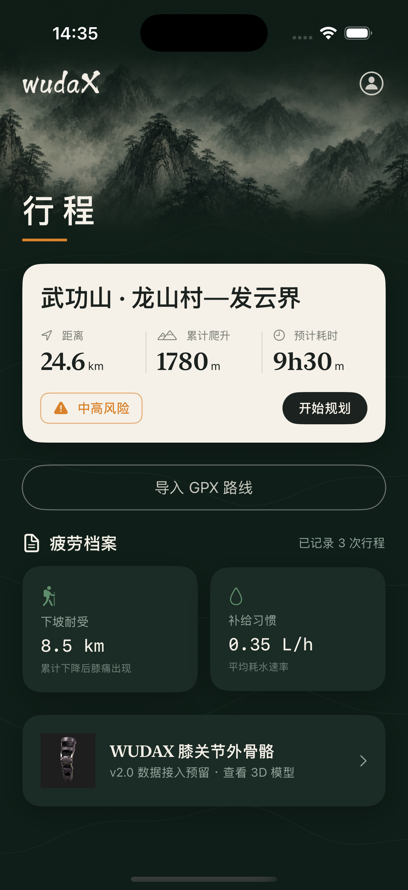
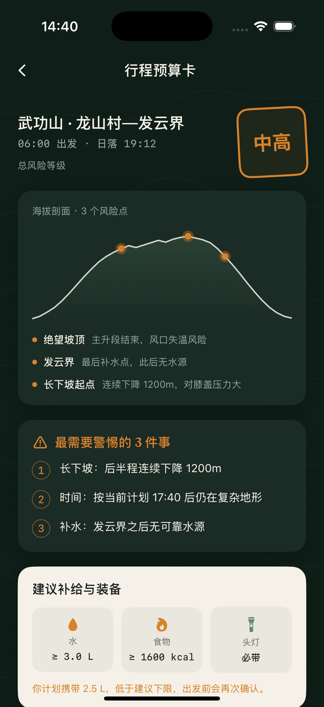
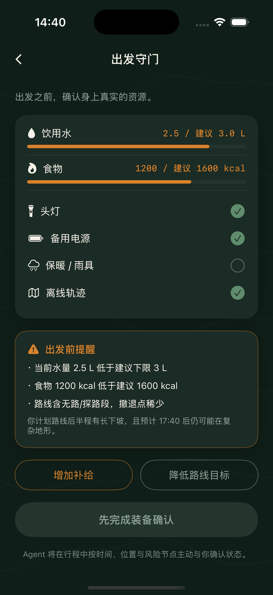
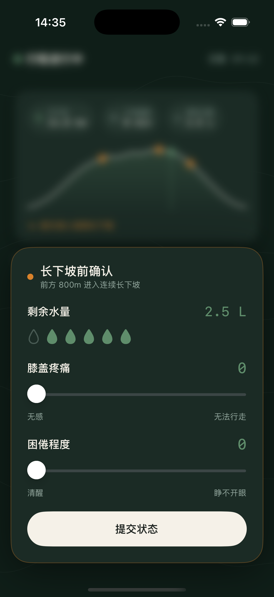
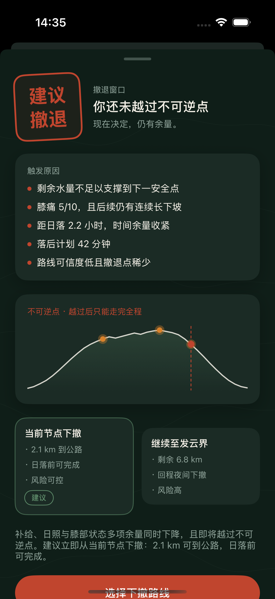
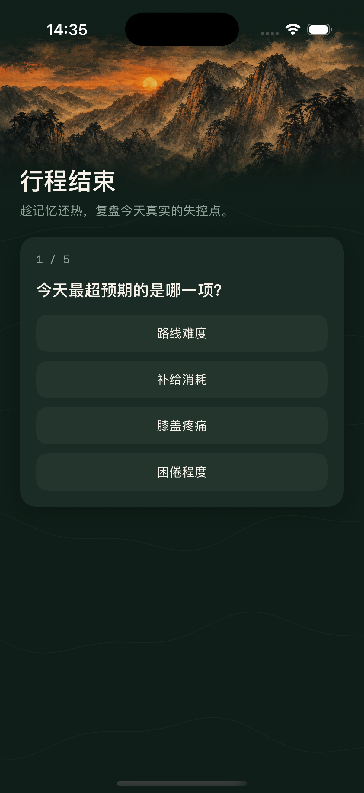
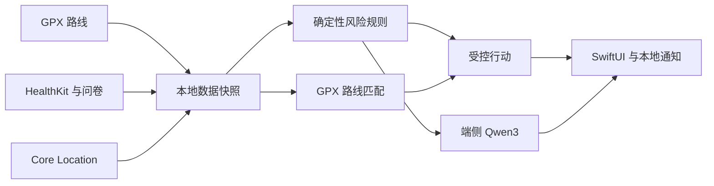

<div align="center">
  

  <h1>WUDAX</h1>

  <p><strong>离线徒步疲劳与风险管理 Agent</strong></p>
  <p>平时安静，关键时刻主动。让每一次继续与下撤，都建立在可解释的余量上。</p>

  <p>
    
    
    
    
    
    
  </p>
</div>

---

## 为什么做 WUDAX

徒步中的疲劳不是一个孤立分数。补给下降、长下坡、膝部不适、困倦、路线进度、GPS 可信度和日照窗口会互相叠加，而真正危险的往往是用户意识到这些变化时，安全余量已经很小。

WUDAX 将 GPX 路线、个人体能、HealthKit、主观疲劳和实时位置放进同一条本地决策链：行前说明挑战差距，行中在关键节点主动询问，风险收紧时给出可解释的降级或下撤建议，行后更新个人疲劳基线。

> 品牌来自庄子“无待”：无感、自然、舒适。平时不打扰，真正需要时才出现。

## 一次完整行程

| 行前 · 认识余量 | 行中 · 主动守护 | 行后 · 形成经验 |
| :--- | :--- | :--- |
| 导入 GPX，读取路线负荷与数据质量 | 弱 GPS 下匹配当前路线进度 | 对比计划与实际距离、耗时、爬升 |
| 结合近期状态、经验与 HealthKit | 在长下坡、日照和补给节点发起问询 | 汇总风险事件和身体反馈 |
| 给出挑战评级、补给和装备建议 | 输出继续、休息、降速、缩短或下撤建议 | 更新下一次行程的疲劳基线 |

```text
导入路线 → 身体与补给评估 → 出发守门 → 行中监测 → 下撤窗口 → 行后复盘
```

## 产品界面

<table>
  <tr>
    <td align="center"></td>
    <td align="center"></td>
    <td align="center"></td>
  </tr>
  <tr>
    <td align="center"><sub>行程首页</sub></td>
    <td align="center"><sub>挑战预算</sub></td>
    <td align="center"><sub>出发守门</sub></td>
  </tr>
  <tr>
    <td align="center"></td>
    <td align="center"></td>
    <td align="center"></td>
  </tr>
  <tr>
    <td align="center"><sub>状态问询</sub></td>
    <td align="center"><sub>下撤决策</sub></td>
    <td align="center"><sub>行后复盘</sub></td>
  </tr>
</table>

仓库同时提供一套可在 Windows 上评审的浏览器原型：默认展示新版“清新山野”方案，并可通过 URL 参数切换到旧版“深绿水墨”方案。浏览器原型用于设计和流程评审，不替代 SwiftUI 真机验证。

### 交互式 3D 模型

WUDAX 的膝关节外骨骼模型保存在仓库内：

- `assets/3d/exoskeleton.glb`
- `assets/3d/exoskeleton.usdz`
- App 打包资源：`WudaX/Sources/Resources/exoskeleton.usdz`

交互页面：[exoskeleton-viewer.html](exoskeleton-viewer.html)

GitHub README 不能直接执行自定义 3D JavaScript，因此没有在这里放不可交互的死图。需要查看可旋转、可缩放的模型时，在仓库根目录启动一个本地静态服务：

```bash
python3 -m http.server 8080
```

然后打开：

```text
http://localhost:8080/exoskeleton-viewer.html
```

如果之后启用 GitHub Pages，同一个页面也可以作为在线交互式查看器使用。

### Landing page

仓库内还有一个与 WUDAX 当前 UI 视觉一致的静态 landing page，包含产品视频、真实界面配图和可旋转 3D 模型：

```bash
python3 -m http.server 8080
```

打开：

```text
http://localhost:8080/landing/
```

页面文件：

- `landing/index.html`
- `landing/styles.css`
- `assets/video/wudax-launch.mp4`
- `assets/3d/exoskeleton.glb`

视频脚本、分镜和逐镜头图片提示词放在 `landing/video/`，后续可以按分镜逐张生成高质量画面，再用剪辑脚本替换当前仓库里的静态串联预览视频。

竖屏小红书 B-roll 预览：

- `assets/video/wudax-broll-vertical.mp4`

## 核心能力

### 完全本地的路线理解

- 容错解析 GPX 轨迹、路线点、航点、海拔与时间戳。
- 清理重复和噪声点，预计算累计距离、爬升、坡度、方位和剩余路线。
- 将实时 GPS 投影到轨迹线段，并结合方向、历史进度、速度与海拔避免错误跳点。
- 对回头路、之字弯、环线和平行路段做连续性判断。
- GPS 短时丢失时显示受限的估算区间，同时保留最后可信位置。

### 可解释的疲劳风险规则

- 输入包括补给、膝痛、困倦、长下坡、日照、进度和路线可信度。
- 输出限定为继续、休息、补水、降速、缩短路线、折返或检查安全。
- 风险只允许由确定性 Swift 规则升级或解除，语言模型不能降低风险等级。
- 通知只在风险升级或冷却期结束时触发，减少无意义打扰。

### 端侧 Agent

- 使用 Apple MLX 在 iPhone 端运行 Qwen3-0.6B 4-bit 模型。
- 模型通过本地工具读取路线、补给和风险结果，仅负责对话引导与解释。
- 模型资源约 335 MB，需要在出发前下载或随 App 打包；准备完成后可离线运行。
- 原始 GPX、行程轨迹、状态记录和复盘报告默认保存在本机。

## 离线架构



无需后端即可工作的部分：GPX 导入与分析、路线匹配、实时定位、风险规则、本地通知、HealthKit 数据归一化、端侧模型调用、行程记录和复盘持久化。

### 当前离线边界

| 能力 | 当前状态 |
| :--- | :--- |
| GPX 路线、海拔、当前位置和路线进度 | ✅ 离线可用 |
| 风险判断、问询、通知和行程记录 | ✅ 离线可用 |
| Qwen3 对话与解释 | ✅ 模型预先准备后离线可用 |
| MapKit 系统缓存底图 | ⚠️ 取决于系统缓存 |
| 完整区域离线底图 | 🚧 尚需 MapLibre 与合法地图资源包 |

没有地图瓦片时，WUDAX 仍显示本地 GPX、当前位置、海拔和路线进度，不会把在线底图伪装成已离线。

## 技术栈

| 模块 | 实现 |
| :--- | :--- |
| App | Swift 5.9 · SwiftUI · iOS 17+ |
| 路线 | Core Location · MapKit · 自研 GPX 预处理与匹配 |
| 健康 | HealthKit |
| 通知 | UserNotifications |
| 端侧模型 | MLXLLM · MLXLMCommon · Qwen3-0.6B 4-bit |
| 数据 | Codable · FileManager · 本地 JSON/GPX 持久化 |
| 工程 | XcodeGen · XCTest |
| UI 评审 | Vite 浏览器原型 |

## 快速开始

### iOS App

需要一台安装了 Xcode、支持 iOS 17 SDK 的 Mac。端侧 MLX 推理需要 Apple Silicon iPhone 真机，模拟器仅用于界面和非模型流程验证。

```bash
git clone https://github.com/FanXuTheRealOne/wudax.git
cd wudax/WudaX
open WudaX.xcodeproj
```

也可以从终端构建模拟器版本：

```bash
DEVELOPER_DIR=/Applications/Xcode.app/Contents/Developer \
xcodebuild \
  -project WudaX.xcodeproj \
  -scheme WudaX \
  -destination 'platform=iOS Simulator,name=iPhone 16 Pro' \
  build
```

运行单元测试：

```bash
DEVELOPER_DIR=/Applications/Xcode.app/Contents/Developer \
xcodebuild \
  -project WudaX.xcodeproj \
  -scheme WudaX \
  -destination 'platform=iOS Simulator,name=iPhone 16 Pro' \
  test
```

### 浏览器 UI 预览

无需 Mac，在 Windows、Linux 或 macOS 上均可运行：

```bash
cd preview
npm install
npm run dev
```

- 新版“清新山野”：`http://localhost:4173/`
- 旧版“深绿水墨”：`http://localhost:4173/?version=legacy`

### 调试页面直达

在 Xcode Scheme 中添加环境变量 `WUDAX_PHASE`，可直接进入指定阶段：

```text
budget | gate | trip | checkin | retreat | review | exo
```

## 项目结构

```text
wudax/
├── WudaX/
│   ├── Sources/
│   │   ├── Agent/            # 行程状态与风险编排
│   │   ├── GPX/              # GPX 解析和质量分析
│   │   ├── RouteMatching/    # 离线路线预处理与匹配
│   │   ├── Rules/            # 确定性风险与建议工具
│   │   ├── Health/           # HealthKit 数据读取
│   │   ├── LocalLLM/         # MLX 端侧模型与工具调用
│   │   ├── Trip/             # 定位和实际轨迹记录
│   │   ├── Offline/          # 离线资源准备与完整性状态
│   │   ├── Persistence/      # 行程与复盘本地持久化
│   │   ├── DesignSystem/     # WUDAX 设计令牌和组件
│   │   └── Views/            # SwiftUI 页面
│   ├── Tests/                # GPX、规则、路线匹配和持久化测试
│   └── project.yml           # XcodeGen 工程配置
├── preview/                  # 新旧两套浏览器 UI 原型
├── design/                   # 设计稿与山景视觉素材
├── screenshots/              # 模拟器截图
├── docs/                     # 产品设计、实现计划与技术说明
├── scripts/                  # 素材和模型准备脚本
└── AGENTS.md                 # UI 设计与反模板提示词规范
```

## MVP 边界与路线图

当前版本定位为安全辅助工具，不是医疗设备，也不替代领队判断、纸质地图、应急通信和个人风险责任。

- [x] 行前三阶段评估、补给预算和出发守门
- [x] GPX 导入、分析、预处理与弱 GPS 路线匹配
- [x] 行中状态问询、风险叠加和下撤建议
- [x] 本地轨迹记录、通知、复盘和疲劳基线
- [x] Qwen3-0.6B 端侧工具调用
- [ ] 真实山野样本的阈值校准与长时间电量测试
- [ ] 完整区域离线底图资源与更新机制
- [ ] HealthKit 真机授权和代表性数据长期验证
- [ ] 膝关节外骨骼实时数据接入

## 安全说明

WUDAX 提供的是基于已输入数据的风险提示与行动建议，不进行医学诊断。GPS、HealthKit、用户自评和路线数据都可能缺失或不准确；在野外应始终准备独立导航、备用电源、保暖与补给，并遵循当地天气、封山和救援规定。

---

<div align="center">
  <strong>无待 · 自在前行</strong><br />
  <sub>Built for quiet decisions in the mountains.</sub>
</div>
