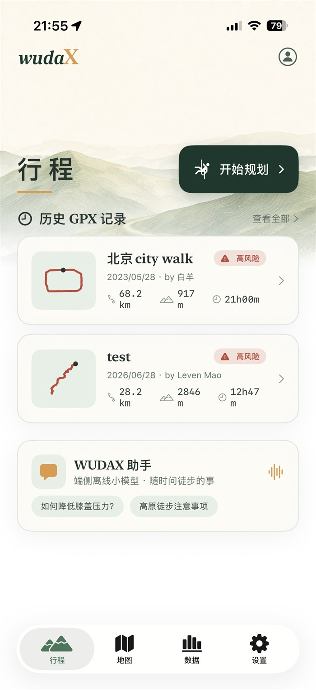
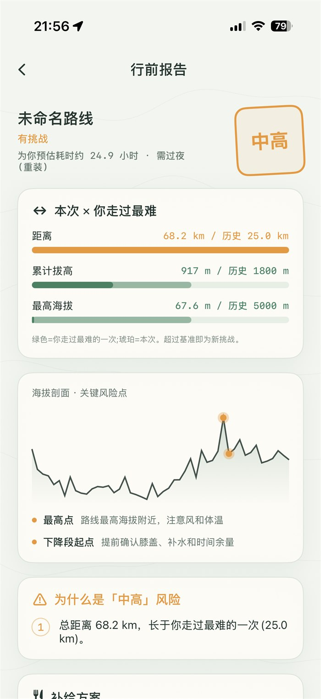
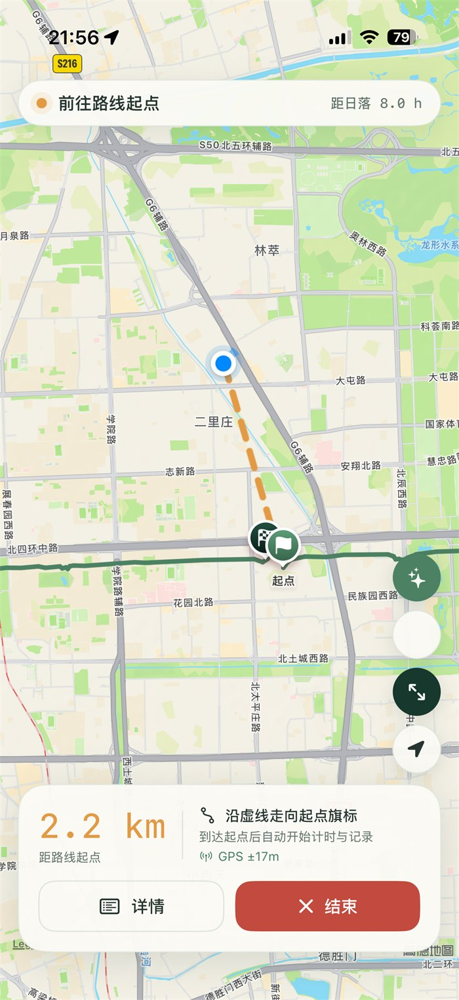
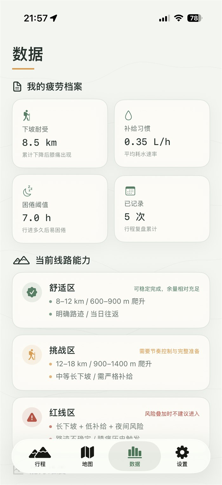
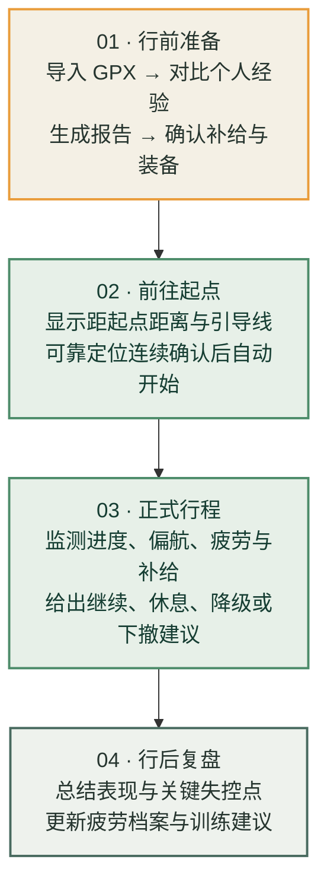
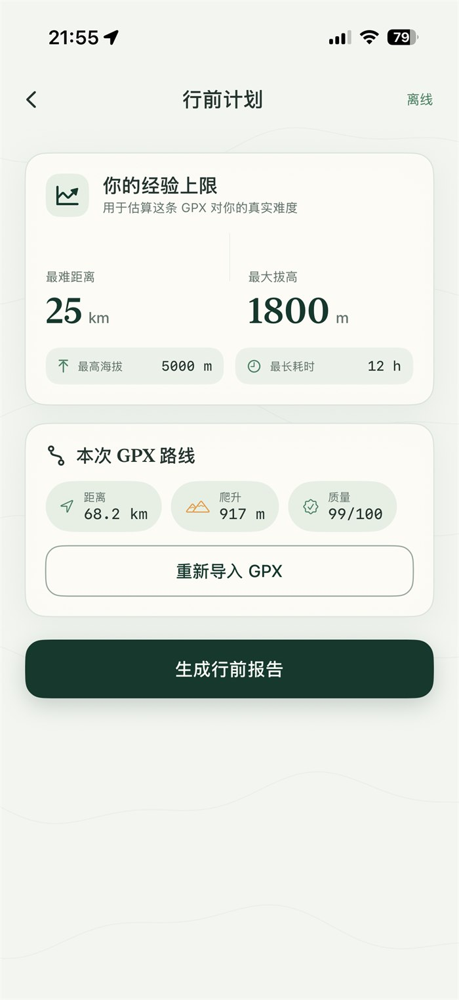
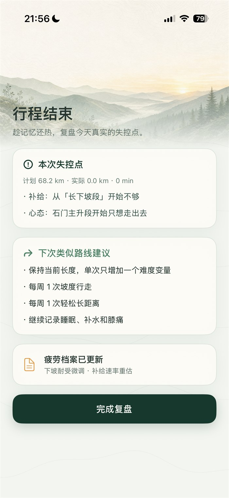
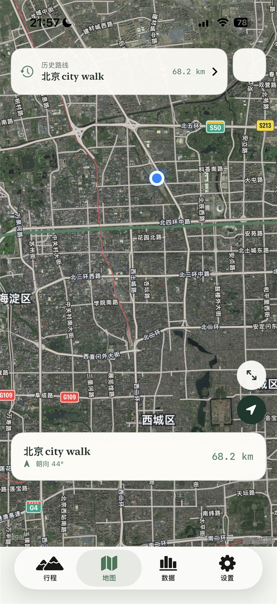
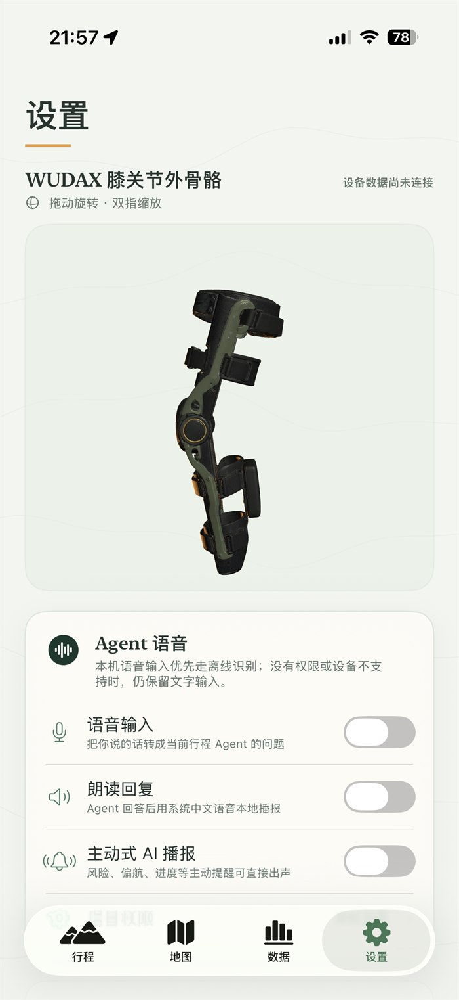
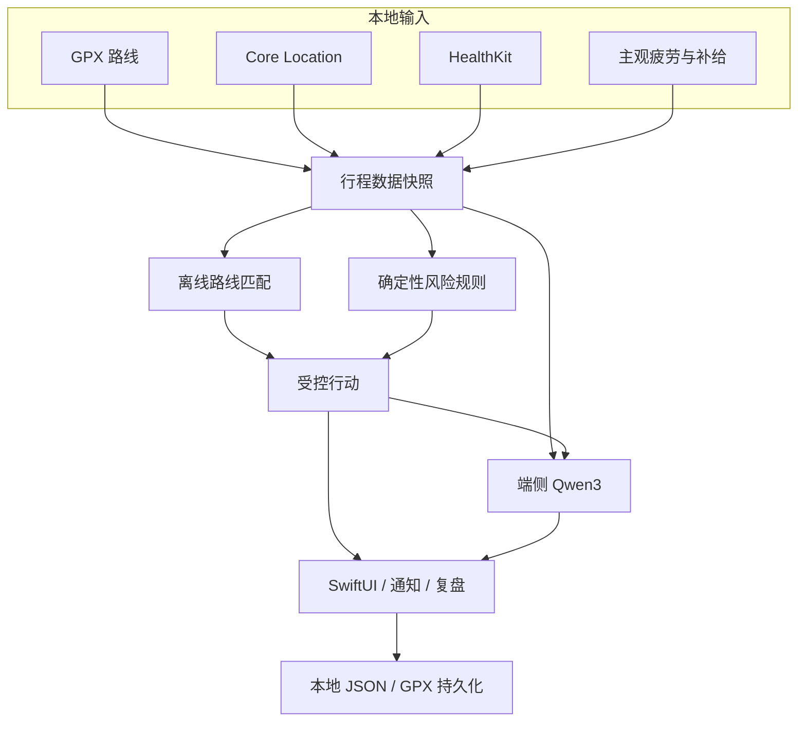

<div align="center">
  

  <h1>WUDAX</h1>

  <p><strong>离线徒步疲劳与风险管理 Agent</strong></p>
  <p>平时安静，关键时刻主动。让每一次继续与下撤，都建立在可解释的安全余量上。</p>

  <p>
    
    
    
    
    
    
    
  </p>
</div>

<p align="center">
  
  
  
  
</p>

## 产品演示

[](assets/video/wudax-agent-demo.mp4)

动态预览会在 README 中直接播放；点击画面可打开带声音的 MP4 原片。

---

## WUDAX 是什么

WUDAX 是一款面向徒步场景的 iPhone 端安全辅助应用。它把 GPX 路线、个人经验、Apple Health、实时定位、主观疲劳和补给余量放进同一条本地决策链：

- 行前理解路线对“这个用户”的真实挑战，给出风险、补给与装备建议。
- 行中在起点、长下坡、补给、日落和偏航等关键节点主动提醒。
- 行后复盘计划与实际表现，持续更新个人疲劳档案。

核心判断由确定性的 Swift 规则完成，端侧小模型负责对话、解释和信息组织。即使模型不可用，路线、风险和受控行动仍能正常工作。

> 名字取意于庄子“无待”：减少打扰与依赖，在真正需要时给出清晰行动。

## 一次完整行程



### 01 / 行前准备

解析 GPX，并与个人最难经历、海拔和时长交叉比较，输出**挑战评级、关键风险点、补给建议与装备清单**。

### 02 / 前往起点

只显示距起点距离和引导线，不提前累计正式行程；进入起点范围并连续获得可靠定位后，才开始计时与记录。

### 03 / 正式行程

持续匹配路线进度，结合心率、补给、日落、膝痛和主观疲劳，提供**低打扰提醒**与可解释的继续、休息、降级或下撤建议。

### 04 / 行后复盘

汇总实际距离、耗时、事件和关键失控点，形成训练建议，并逐步校准用户的个人能力与疲劳档案。

## 产品界面

<table>
  <tr>
    <td align="center" width="25%"></td>
    <td align="center" width="25%"></td>
    <td align="center" width="25%"></td>
    <td align="center" width="25%"></td>
  </tr>
  <tr>
    <td align="center"><sub>历史路线与端侧助手</sub></td>
    <td align="center"><sub>经验上限与 GPX 导入</sub></td>
    <td align="center"><sub>挑战差距与风险解释</sub></td>
    <td align="center"><sub>原生定位与起点门控</sub></td>
  </tr>
  <tr>
    <td align="center"></td>
    <td align="center"></td>
    <td align="center"></td>
    <td align="center"></td>
  </tr>
  <tr>
    <td align="center"><sub>失控点与训练建议</sub></td>
    <td align="center"><sub>历史路线、图层与自身聚焦</sub></td>
    <td align="center"><sub>能力区间与健康数据</sub></td>
    <td align="center"><sub>外骨骼概念与 Agent 配置</sub></td>
  </tr>
</table>

仓库同时提供一套可在 Windows 上评审的浏览器原型：默认展示新版“清新山野”方案，并可通过 URL 参数切换到旧版“深绿水墨”方案。浏览器原型用于设计和流程评审，不替代 SwiftUI 真机验证。

### 交互式 3D 模型

WUDAX 的膝关节外骨骼模型保存在仓库内：

- `assets/3d/exoskeleton.glb`
- `assets/3d/exoskeleton.usdz`
- App 打包资源：`WudaX/Sources/Resources/exoskeleton.usdz`

交互页面：[exoskeleton-viewer.html](exoskeleton-viewer.html)

GitHub README 不能直接执行自定义 3D JavaScript，因此没有在这里放不可交互的死图。需要查看可旋转、可缩放的模型时，在仓库根目录启动一个本地静态服务：

```bash
python3 -m http.server 8080
```

然后打开：

```text
http://localhost:8080/exoskeleton-viewer.html
```

如果之后启用 GitHub Pages，同一个页面也可以作为在线交互式查看器使用。

### Landing page

仓库内还有一个与 WUDAX 当前 UI 视觉一致的静态 landing page，包含产品视频、真实界面配图和可旋转 3D 模型：

```bash
python3 -m http.server 8080
```

打开：

```text
http://localhost:8080/landing/
```

页面文件：

- `landing/index.html`
- `landing/styles.css`
- `assets/video/wudax-launch.mp4`
- `assets/3d/exoskeleton.glb`

视频脚本、分镜和逐镜头图片提示词放在 `landing/video/`，后续可以按分镜逐张生成高质量画面，再用剪辑脚本替换当前仓库里的静态串联预览视频。

竖屏小红书 B-roll 预览：

- `assets/video/wudax-broll-vertical.mp4`

## 核心能力

### GPX 行前理解

- 容错解析轨迹、路线点、航点、海拔与时间戳。
- 分析距离、累计爬升、路线质量、海拔剖面和关键风险段。
- 将本次路线与用户最难距离、最大爬升、最高海拔和最长耗时比较。
- 输出挑战评级、风险原因、饮水/热量建议和装备确认清单。

### 弱 GPS 路线匹配

- 使用 MapKit 与 Core Location 显示原生用户位置、方向和路线图层。
- 将实时 GPS 投影到 GPX 线段，并结合方向、历史进度、速度和海拔减少错误跳点。
- 处理回头路、环线、之字弯和平行路段，保留最后可信进度。
- 到达起点前仅更新“距起点距离”；进入 60 米范围且连续获得可靠定位后才开始计时、记录和路线进度。
- 支持标准、卫星、混合图层，以及路线聚焦与自身定位聚焦。

### 可解释的疲劳管理

- 综合距离、爬升、长下坡、补给、膝痛、困倦、日照、进度与定位可信度。
- 风险只能由确定性规则升级或解除；语言模型不能覆盖安全结论。
- 受控行动限定为继续、休息、补水、降速、缩短路线、折返或检查安全。
- 通过复盘逐步校准下坡耐受、补给速率、困倦阈值和能力区间。

### Apple Health

- 在真机上请求 HealthKit 读取权限，并对无权限、无数据和设备不支持进行明确提示。
- 可视化最近心率、静息心率、HRV、血氧、呼吸频率、睡眠与 VO₂ Max。
- 步数、活动能量、运动时间和步行/跑步距离按今日累计展示。
- 行程中周期刷新已同步到 Apple Health 的数据；秒级 Apple Watch 心率需要后续 watchOS WorkoutSession。

### 端侧 Agent

- 使用 Apple MLX 在 iPhone 真机运行 Qwen3-0.6B 4-bit。
- 模型通过本地工具读取路线、补给、风险、健康数据和行程事件。
- 模型只负责对话与解释；失败时自动降级为规则引擎文案。
- 模型准备完成后可离线运行，用户的 GPX、轨迹、状态与复盘默认留在设备端。

## 本地架构



核心行程不依赖业务后端：GPX 解析、路线匹配、定位、风险规则、HealthKit 归一化、端侧推理、通知和复盘均在设备上完成。

## 离线边界

| 能力 | 当前状态 |
| :--- | :--- |
| GPX 路线、海拔、当前位置与路线进度 | ✅ 离线可用 |
| 风险判断、询问、通知、轨迹与复盘 | ✅ 离线可用 |
| Qwen3 对话与解释 | ✅ 模型预先准备后离线可用 |
| MapKit 底图 | ⚠️ 依赖 Apple 地图服务或系统已有缓存 |
| 完整区域离线底图 | 🚧 尚需合法地图源与 MapLibre/离线资源包 |

没有底图瓦片时，WUDAX 仍可保留本地 GPX、定位、海拔和路线进度；项目不会把在线底图描述为完整离线地图。

## 技术栈

| 模块 | 实现 |
| :--- | :--- |
| App | Swift 5.9 · SwiftUI · iOS 17+ |
| 地图与定位 | MapKit · Core Location · 自研 GPX 预处理/匹配 |
| 健康数据 | HealthKit · HKStatisticsQuery · Observer Query |
| 风险与 Agent | 确定性 Swift 规则 · MLXLLM · Qwen3-0.6B 4-bit |
| 本地数据 | Codable · FileManager · JSON / GPX |
| 通知 | UserNotifications |
| 3D | SceneKit · USDZ / GLB 资产 |
| 工程与测试 | XcodeGen · XCTest |
| UI 预览 | Vite 浏览器原型 |

## 快速开始

### 运行 iOS App

需要 macOS、Xcode 15+ 和 iOS 17 SDK。定位、HealthKit、端侧 MLX 与后台行为应使用真实 iPhone 验证。

```bash
git clone https://github.com/FanXuTheRealOne/wudax.git
cd wudax

# 准备约 335 MB 的端侧模型资源
python3 scripts/fetch_model.py

cd WudaX
open WudaX.xcodeproj
```

如果修改了 `project.yml` 或新增/删除源文件，先重新生成工程：

```bash
cd WudaX
xcodegen generate
```

运行测试：

```bash
DEVELOPER_DIR=/Applications/Xcode.app/Contents/Developer \
xcodebuild \
  -project WudaX.xcodeproj \
  -scheme WudaX \
  -destination 'platform=iOS Simulator,name=iPhone 16 Pro' \
  test
```

> HealthKit、后台定位和 MLX 推理需要正确的签名、Capability 与真实设备。模拟器主要用于 UI、GPX、规则和持久化测试。

### 浏览器 UI 预览

无需 Mac，可在 Windows、Linux 或 macOS 查看静态交互原型：

```bash
cd preview
npm install
npm run dev
```

- 当前清新山野方案：`http://localhost:4173/`
- 历史深绿水墨方案：`http://localhost:4173/?version=legacy`

浏览器版本用于设计评审，不包含原生 MapKit、HealthKit、Core Location 或端侧 MLX 能力。

## 项目结构

```text
wudax/
├── WudaX/
│   ├── Sources/
│   │   ├── Agent/            # 行程状态、数据总线与主动 Agent
│   │   ├── GPX/              # GPX 解析与路线质量分析
│   │   ├── RouteMatching/    # 弱 GPS 路线预处理与匹配
│   │   ├── Rules/            # 确定性风险和行动工具
│   │   ├── Health/           # HealthKit 授权、查询与归一化
│   │   ├── LocalLLM/         # MLX 端侧模型与工具调用
│   │   ├── Trip/             # 定位与实际轨迹记录
│   │   ├── Offline/          # 离线资源准备状态
│   │   ├── Persistence/      # 路线、行程与复盘持久化
│   │   ├── DesignSystem/     # 颜色、字体和复用组件
│   │   └── Views/            # SwiftUI 页面
│   ├── Tests/                # GPX、规则、匹配、门控与存储测试
│   └── project.yml           # XcodeGen 工程配置
├── docs/                     # 产品设计、实现规范与截图
├── preview/                  # 浏览器 UI 原型
├── design/                   # 品牌和视觉素材
├── screenshots/              # 历史模拟器截图
├── scripts/                  # 模型与资源准备脚本
└── AGENTS.md                 # UI 设计与实现约束
```

## 当前进度

- [x] 历史 GPX 路线库与双入口行前规划
- [x] 路线/经验对比、挑战评级、补给和装备建议
- [x] 起点门控、原生 MapKit 定位、方向标与图层切换
- [x] 弱 GPS 路线匹配、短时丢失降级与偏航提醒
- [x] 主观疲劳询问、可解释风险规则与下撤建议
- [x] HealthKit 授权、关键健康指标和今日活动可视化
- [x] 端侧 Qwen3 Agent 与规则文案降级
- [x] 行程记录、复盘、训练建议和疲劳档案更新
- [x] 膝关节外骨骼 3D 展示与数据接入预留
- [ ] Apple Watch 副屏、风险确认与 WorkoutSession 实时心率
- [ ] 完整区域离线矢量地图与更新机制
- [ ] 森林、峡谷、回头路和长时间后台定位的实地标定
- [ ] 外骨骼 BLE/传感器遥测与闭环疲劳控制

## 安全说明

WUDAX 是徒步安全辅助工具，不是医疗设备，也不替代领队判断、专业导航、纸质地图、应急通信或个人风险责任。

GPS、HealthKit、GPX、天气与用户自评都可能缺失、延迟或不准确。野外活动应始终准备独立导航、备用电源、保暖与补给，并遵守当地天气、封山和救援规定。

---

<div align="center">
  <strong>无待 · 自在前行</strong><br />
  <sub>Built for quiet decisions in the mountains.</sub>
</div>
